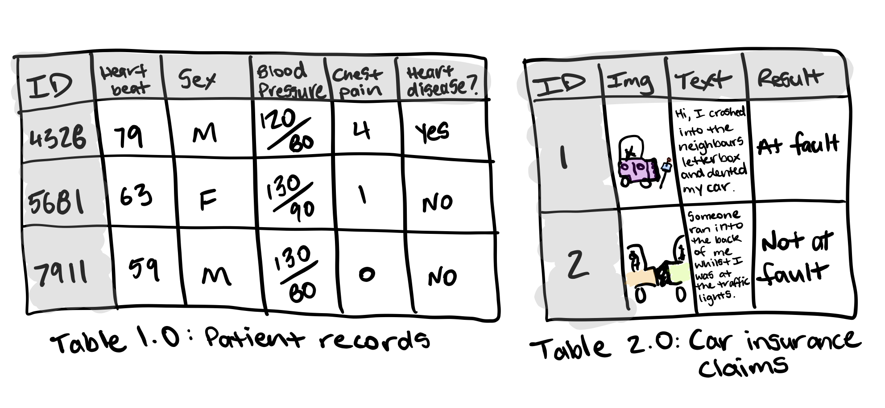
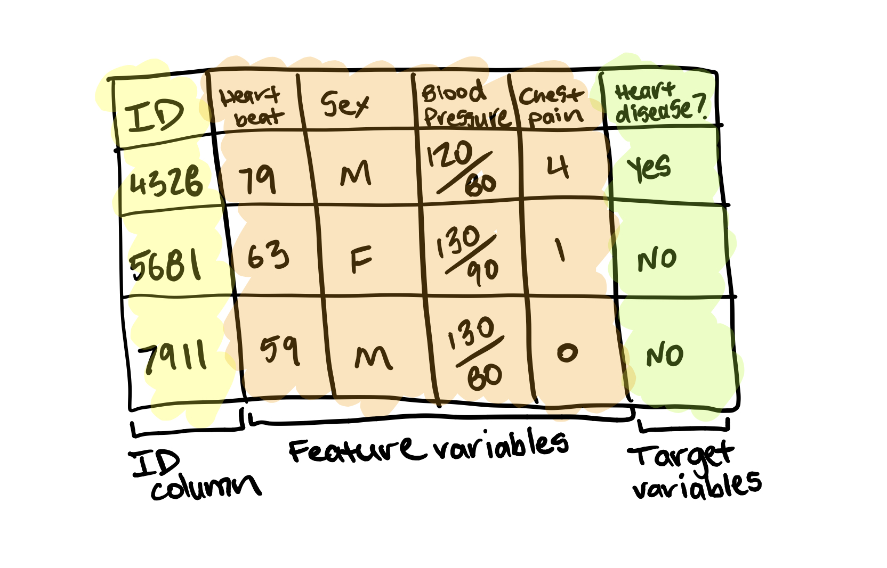

# A 6 Step Framework for Approaching Machine Learning Projects 

How is machine learning, artificial intelligence and data science different?

## 6 steps for our next machine learning project
A machine learning pipeline can be broken down into three major steps. Data collection, data modelling and deployment.

Modelling refers to using a machine learning algorithm to find insights within our collected data.

There are many different types of machine learning algorithms and some perform better than others on different problems. But the premise remains, they all have the goal of finding patterns or sets of instructions in data.

This article focuses on data modelling. It assumes we have already collected data, and are looking to build a machine learning proof of concept with it.

1. **Problem definition**]— What business problem are we trying to solve? How can it be phrased as a machine learning problem?
2. **Data** — If machine learning is getting insights out of data, what data we have? How does it match the problem definition? Is our data structured or unstructured? Static or streaming?
3. **Evaluation** — What defines success? Is a 95% accurate machine learning model good enough?
4. **Features** — What parts of our data are we going to use for our model? How can what we already know influence this?
5. **Modelling** — Which model should we choose? How can we improve it? How do we compare it with other models?
6. **Experimentation**— What else could we try? Does our deployed model do as we expected? How do the other steps change based on what we’ve found?

Let’s dive a little deeper in each.

## 1. Problem definition — Rephrase our business problem as a machine learning problem
The first step is to match the business problem we’re trying to solve a machine learning problem.

The four major types of machine learning are supervised learning, unsupervised learning, transfer learning and reinforcement learning (there’s semi-supervised as well but I’ve left it out for brevity). The three most used in business applications are supervised learning, unsupervised learning and transfer learning.

### Supervised learning
Supervised learning, is called supervised because we have data and labels. A machine learning algorithm tries to learn what patterns in the data lead to the labels. The supervised part happens during training. If the algorithm guesses a wrong label, it tries to correct itself.

### Unsupervised learning
Unsupervised learning is when we have data but no labels. The data could be the purchase history of our online video game store customers. 

After inspecting the groups, we provide the labels. There may be a group interested in computer games, another group who prefer console games and another which only buy discounted older games. This is called clustering.

What’s important to remember here is the algorithm did not provide these labels. It found the patterns between similar customers and using our domain knowledge, we provided the labels.

### Transfer learning
Transfer learning is when we take the information an existing machine learning model has learned and adjust it to our own problem.

- **Classification** — Do we want to predict whether something is one thing or another? Such as whether a customer will churn or not churn? Or whether a patient has heart disease or not? Note, there can be more than two things. Two classes is called binary classification, more than two classes is called multi-class classification. Multi-label is when an item can belong to more than one class.
- **Regression** — Do we want to predict a specific number of something? Such as how much a house will sell for? Or how many customers will visit our site next month?
- **Recommendation** — Do we want to recommend something to someone? Such as products to buy based on their previous purchases? Or articles to read based on their reading history?

## 2. Data — If machine learning is getting insights out of data, what data do we have?
The data we have or need to collect will depend on the problem we want to solve.

If we already have data, it’s likely it will be in one of two forms. Structured or unstructured. Within each of these, we have static or streaming data.

- **Structured data** — Think a table of rows and columns, an Excel spreadsheet of customer transactions, a database of patient records. Columns can be numerical, such as average heart rate, categorical, such as sex, or ordinal, such as chest pain intensity.
- **Unstructured data** — Anything not immediately able to be put into row and column format, images, audio files, natural language text.
- **Static data** — Existing historical data which is unlikely to change. our companies customer purchase history is a good example.
- **Streaming data** — Data which is constantly updated, older records may be changed, newer records are constantly being added.

There are overlaps.

our static structured table of information may have columns which contain natural language text and photos and be updated constantly.

For predicting heart disease, one column may be sex, another average heart rate, another average blood pressure, another chest pain intensity.

For the insurance claim example, one column may be the text a customer has sent in for the claim, another may be the image they’ve sent in along with the text and a final a column being the outcome of the claim. This table gets updated with new claims or altered results of old claims daily.

The principle remains. we want to use the data we have to gains insights or predict something.

For supervised learning, this involves using the feature variable(s) to predict the target variable(s). A feature variable for predicting heart disease could be sex with the target variable being whether or not the patient has heart disease.

 

For unsupervised learning, we won’t have labels. But we’ll still want to find patterns. Meaning, grouping together similar samples and finding samples which are outliers.

For transfer learning, our problem stays a supervised learning problem, except we’re leveraging the patterns machine learning algorithms have learned from other data sources separate from our own.

## 3. Evaluation — What defines success? Is a 95% accurate machine learning model good enough?
we’ve defined our business problem in machine learning terms and we have data. Now define what defines success.
There are different evaluation metrics for classification, regression and recommendation problems. Which one we choose will depend on our goal.

> For this project to be successful, the model needs to be over 95% accurate at whether someone is at fault or not at fault.

A 95% accurate model may sound pretty good for predicting who’s at fault in an insurance claim. But for predicting heart disease, we’ll likely want better results.

Other things we should take into consideration for classification problems.

- **False negatives** — Model predicts negative, actually positive. In some cases, like email spam prediction, false negatives aren’t too much to worry about. But if a self-driving cars computer vision system predicts no pedestrian when there was one, this is not good.
- **False positives** — Model predicts positive, actually negative. Predicting someone has heart disease when they don’t, might seem okay. Better to be safe right? Not if it negatively affects the person’s lifestyle or sets them on a treatment plan they don’t need.
- **True negatives** — Model predicts negative, actually negative. This is good.
- **True positives** — Model predicts positive, actually positive. This is good.
- **Precision** — What proportion of positive predictions were actually correct? A model that produces no false positives has a precision of 1.0.
- **Recall** — What proportion of actual positives were predicted correctly? A model that produces no false negatives has a recall of 1.0.
- **F1 score** — A combination of precision and recall. The closer to 1.0, the better.
- **Receiver operating characteristic (ROC) curve & Area under the curve (AUC)** — The ROC curve is a plot comparing true positive and false positive rate. The AUC metric is the area under the ROC curve. A model whose predictions are 100% wrong has an AUC of 0.0, one whose predictions are 100% right has an AUC of 1.0.

For regression problems (where we want to predict a number), we’ll want to minimise the difference between what our model predicts and what the actual value is. If we’re trying to predict the price a house will sell for, we’ll want our model to get as close as possible to the actual price. To do this, use MAE or RMSE.

- **Mean absolute error (MAE)** — The average difference between our model's predictions and the actual numbers.
- **Root mean square error (RMSE)** — The square root of the average of squared differences between our model's predictions and the actual numbers.

Use RMSE if we want large errors to be more significant. Such as, predicting a house to be sold at $300,000 instead of $200,000 and being off by $100,000 is more than twice as bad as being off by $50,000. Or MAE if being off by $100,000 is twice as bad as being off by $50,000.

- **Precision @ k (precision up to k)** — Same as regular precision, however, we choose the cutoff, k. For example, precision at 5, means we only care about the top 5 recommendations. we may have 10,000 products. But we can’t recommend them all to our customers.

To begin with, we may not have an exact figure for each of these. But knowing what metrics we should be paying attention to gives we an idea of how to evaluate our machine learning project.

## 4. Features — What features does our data have and which can we use to build our model?
Not all data is the same. And when we hear someone referring to features, they’re referring to different kinds of data within data.

The three main types of features are categorical, continuous (or numerical) and derived.

- **Categorical features** — One or the other(s). For example, in our heart disease problem, the sex of the patient. Or for an online store, whether or not someone has made a purchase or not.

- **Continuous (or numerical) features** — A numerical value such as average heart rate or the number of times logged in.
Derived features — Features we create from the data. Often referred to as feature engineering. Feature engineering is how a subject matter expert takes their knowledge and encodes it into the data. we might combine the number of times logged in with timestamps to make a feature called time since last login. Or turn dates from numbers into “is a weekday (yes)” and “is a weekday (no)”.

Text, images and almost anything we can imagine can also be a feature. Regardless, they all get turned into numbers before a machine learning algorithm can model them.

Some important things to remember when it comes to features.

- **Keep them the same during experimentation (training) and production (testing)** — A machine learning model should be trained on features which represent as close as possible to what it will be used for in a real system.
- **Work with subject matter experts** — What do we already know about the problem, how can that influence what features we use? Let our machine learning engineers and data scientists know this.
- **Are they worth it?** — If only 10% of our samples have a feature, is it worth incorporating it in a model? Have a preference for features with the most coverage. The ones where lots of samples have data for.
- **Perfect equals broken** — If our model is achieving perfect performance, we’ve likely got feature leakage somewhere. Which means the data our model has trained on is being used to test it. No model is perfect.

## 5. Modelling — Which model should we choose? How can we improve it? How do we compare it with other models?
Once we’ve defined our problem, prepared our data, evaluation criteria and features it’s time to model.

Modelling breaks into three parts, choosing a model, improving a model, comparing it with others.

### Choosing a model
- **Interpretability and ease to debug** — Why did a model make a decision it made? How can the errors be fixed?
- **Amount of data** — How much data do we have? Will this change?
- **Training and prediction limitations** — This ties in with the above, how much time and resources do we have for training and prediction?

To address these, start simple. A state of the art model can be tempting to reach for. But if it requires 10x the compute resources to train and prediction times are 5x longer for a 2% boost in our evaluation metric, it might not be the best choice.

Linear models such as logistic regression are usually easier to interpret, are very fast for training and predict faster than deeper models such as neural networks.

Deep models such as neural networks generally work best on unstructured data like images, audio files and natural language text. However, the trade-off is they usually take longer to train, are harder to debug and prediction time takes longer. 

Transfer learning is an approach which takes advantage of deep models and linear models. It involves taking a pre-trained deep model and using the patterns it has learned as the inputs to our linear model. This saves dramatically on training time and allows we to experiment faster.

Where do I find pre-trained models?

Pre-trained models are available on [PyTorch hub](https://pytorch.org/hub), [TensorFlow hub](https://www.tensorflow.org/hub), [model zoo](https://modelzoo.co/) and within the [fast.ai](https://www.fast.ai/) framework. This is a good place to look first for building any kind of proof of concept.

### Tuning and improving a model
A model's first results isn’t its last. Like tuning a car, machine learning models can be tuned to improve performance.

Tuning a model involves changing hyperparameters such as learning rate or optimizer. Or model-specific architecture factors such as number of trees for random forests and number of and type of layers for neural networks.

### Comparing models
Compare apples to apples.

- Model 1, trained on data X, evaluated on data Y.
- Model 2, trained on data X, evaluated on data Y.

Where model 1 and 2 can vary but not data X or data Y.

## 6. Experimentation — What else could we try? How do the other steps change based on what we’ve found? Does our deployed model do as we expected?
This step involves all the other steps. Because machine learning is a highly iterative process, we’ll want to make sure our experiments are actionable.

our biggest goal should be minimising the time between offline experiments and online experiments.

Offline experiments are steps we take when our project isn’t customer-facing yet. Online experiments happen when our machine learning model is in production.

All experiments should be conducted on different portions of our data.

- **Training data set** — Use this set for model training, 70–80% of our data is the standard.
- **Validation/development data set** — Use this set for model tuning, 10–15% of our data is the standard.
- **Test data set** — Use this set for model testing and comparison, 10–15% of our data is the standard.

These amounts can fluctuate slightly, depending on our problem and the data we have.

Poor performance on training data means the model hasn’t learned properly. Try a different model, improve the existing one, collect more data, collect better data.

Poor performance on test data means our model doesn’t generalise well. our model may be overfitting the training data. Use a simpler model or collect more data.

This means saving updated models and updated datasets regularly.

## In the meantime, there are some things to note.

**It’s always about the data.** 

**Deployment changes everything.** 

**Data collection and model deployment are the longest parts of a machine learning pipeline.** 

**Tools of the trade vary. Machine learning is big tool comprised of many other tools.** 
